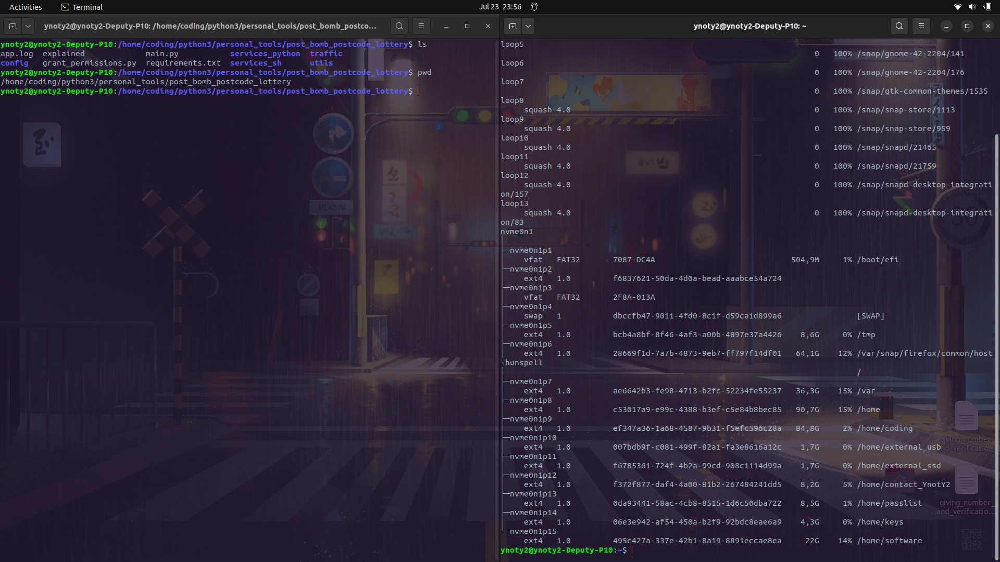
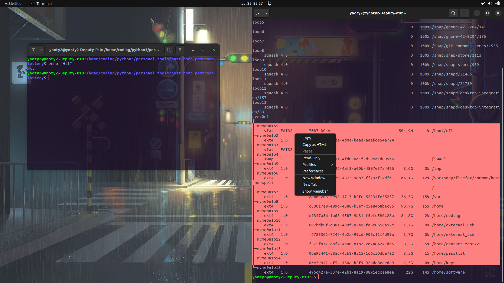
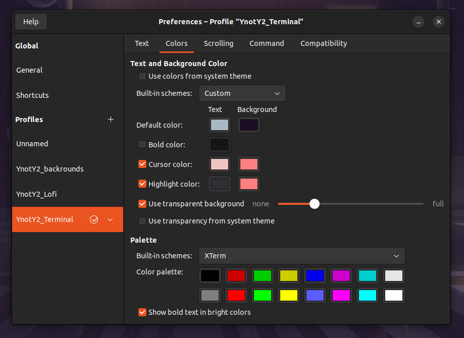
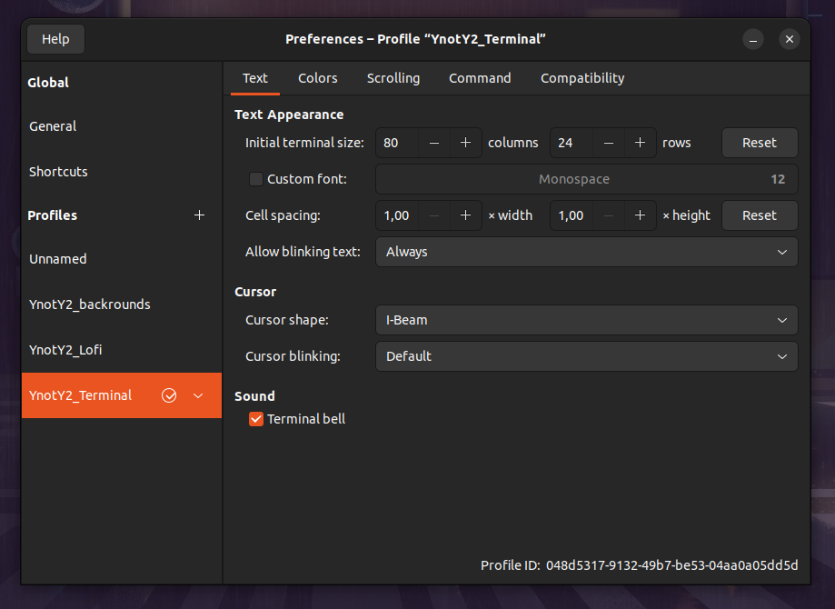
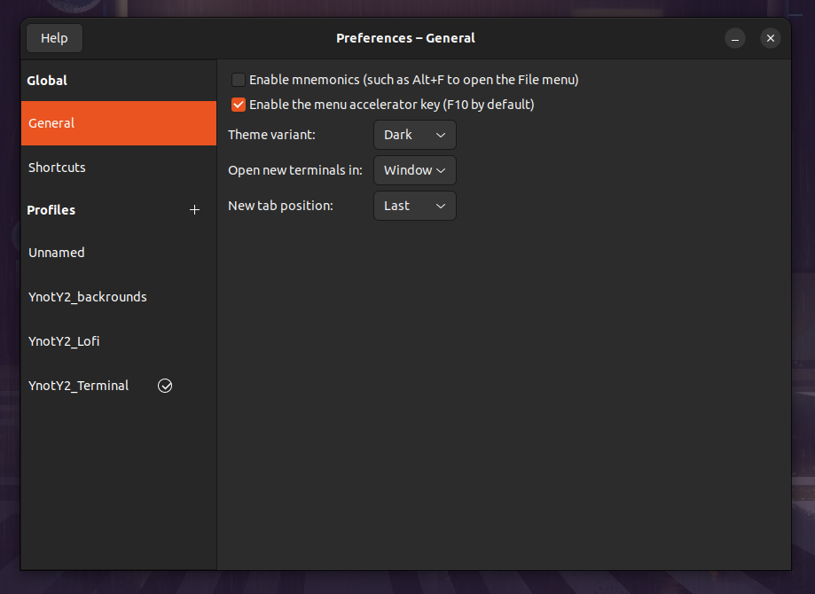
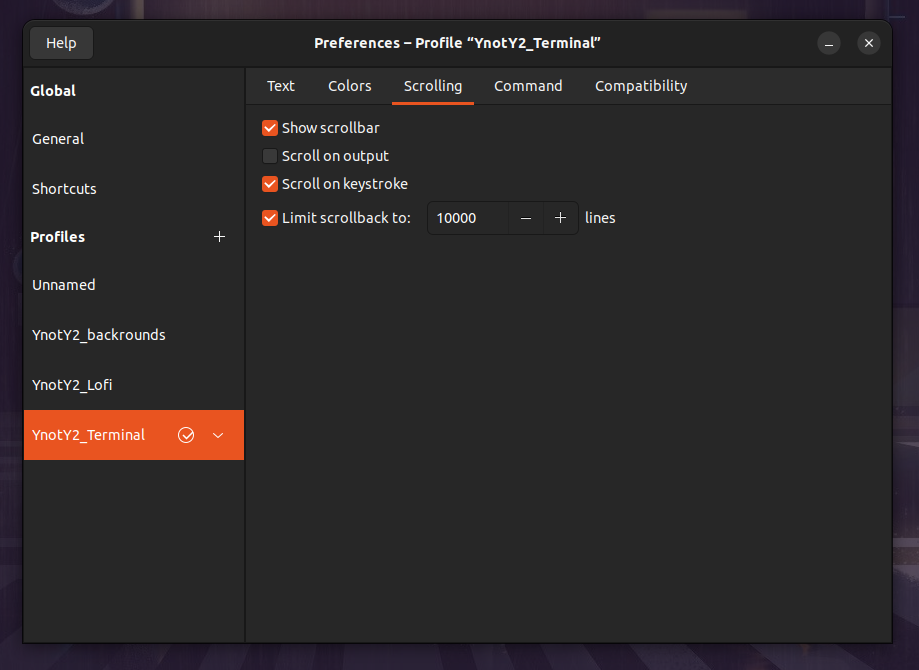

# Lofi terminal settings 🌱
This is a quick  overview for my Gnome-Terminal settings

# Terminal currently visualised:




## Text and Background Color:


Built-in-schemes:  'custom'
```
___________________|| TEXT ||______|| BACKGROUND||__________
Default color:      #AAB8C2            #1B0C26

Cursor color:       #F1C3C3            #FF8080

Highlight color:    #2C2F33            #FF8080

```


## Text Appearance:


## Global Preferences 


## Scrolling Settings



